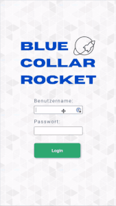

# Blue Collar Rocket

## About this App

I built this as a capstone project of our web development boot camp.

Blue Collar Rocket is an app to streamline processes in craftsmanship. Delight your customers with excellent consulting and lightning-fast service. Motivate and reward your employees through an easy bonus system. Increase your revenue.

## Try it live

- [Blue Collar Rocket Deployment](https://blue-collar-rocket.herokuapp.com/)
  - Please be patient. It could take up to 30 seconds to spin up the server.

## Install the app

Fell free to clone this repository and play around.

### Requirements

To get the app to work you need the following services:

- MongoDB
- Cloudinary database

### Installation

- Clone this repository
- Run `npm i` in the main folder
- Have fun 🚀

## Run the app

- To start the app run `npm run dev`
- To start storybook run `npm run storybook`
- To start the tests run `npm run test:watch`
